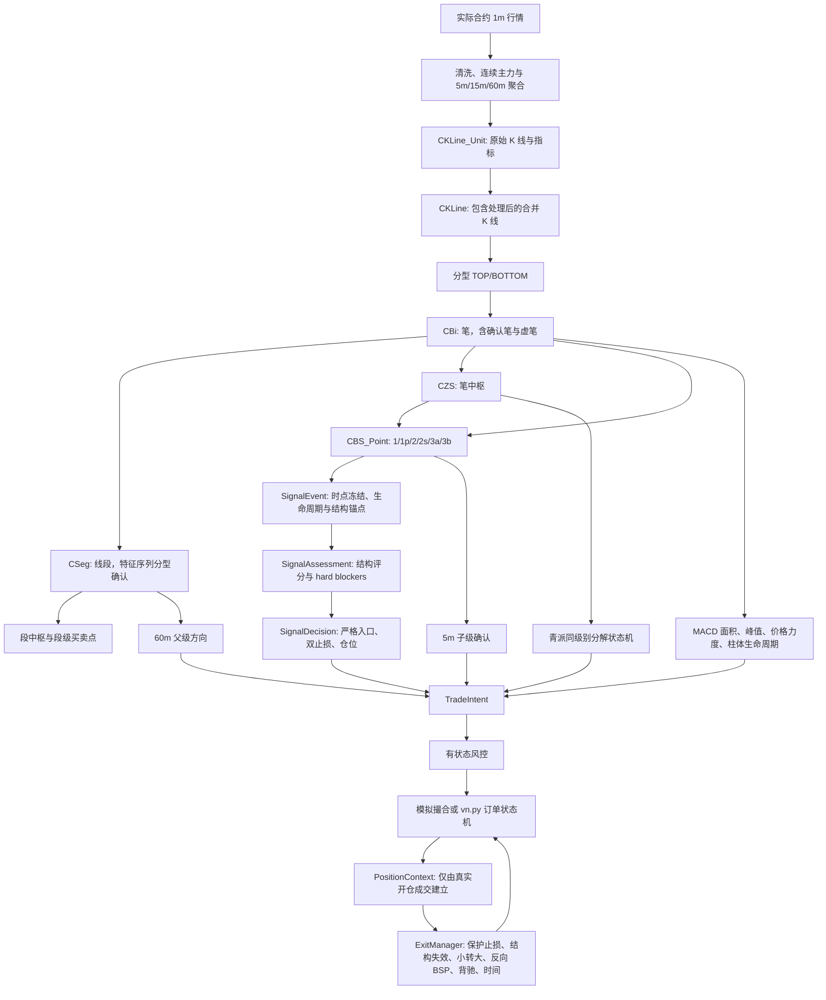

# 青派缠论底层代码与 RB 交易策略全局审查基线

更新时间：2026-08-10  
代码基线：`qing_chan` 分支，HEAD `b122917f7ab3632c1a73e87b21c30c6bceb487ba`，包含当前未提交的机制审计修订  
适用对象：人工审核、Codex 审核、其他 AI 交叉审核  
当前策略：`configs/rb_15m_qingpai_strict.yaml`

## 0. 本文的边界与审查方法

本文要解决的是“整套系统现在究竟怎样工作”，不是证明某种理论绝对正确，也不是证明策略可以盈利。

必须同时区分三件事：

1. **实现正确性**：代码是否忠实执行已经写下的规则，是否时间诚实，回测与实盘是否同义。
2. **青派符合度**：当前量化规则是否真正符合用户所学的青派缠论，仍需人工确认的边界不能由回测收益替代。
3. **经济有效性**：规则即使实现正确，也必须在未见样本、成本压力和前向仿真中证明具有可重复的正期望。

本文使用三种证据标记：

- `代码事实`：可直接从当前源码和配置验证。
- `规则契约`：来自 `QINGPAI_RULEBOOK_V1.md` 和 `configs/qingpai_rule_contract_v1.json`，其中部分状态仍是 `provisional`、`research_candidate` 或 `deferred`。
- `研究观察`：来自当前机制审计和回测，只用于提出问题，不能反向定义理论。

最重要的架构边界是：

> `chan.py` 核心负责从行情计算结构；青派外围层负责冻结、解释和约束结构；交易策略负责把被接受的结构变成可执行、可风控、可追踪的仓位。

任何修改都应先说明它属于哪一层。不要用执行层参数弥补结构定义错误，也不要为了改善几笔交易而重写底层结构。

## 1. 全局对象链



这条链中，越靠前的变化影响面越大。例如修改分型会同时改变笔、线段、中枢、所有 BSP、评分、父子级确认、止损锚点、出场和全部历史交易；修改手续费只影响成交与收益，不应改变结构或信号。

## 2. 青派底层结构及代码实现

### 2.1 原始 K 线单元 `CKLine_Unit`

**理论角色**

一根原始 K 线是最小行情观察单元。它本身不是分型、笔或买卖点。任何高层结构都必须能追溯到当时已经收盘的原始 K 线。

**代码实现**

- 文件：`KLine/KLine_Unit.py`
- 类：`CKLine_Unit`
- 主要字段：`time/open/high/low/close`、成交量和成交额、`idx`、`pre/next`、所属合并 K 线 `klc`、父子级关系。
- `check()` 验证高低价与开收盘的一致性。
- `set_metric()` 在 K 线进入结构引擎时依次计算 MACD、BOLL、RSI、KDJ 等已配置指标。
- `add_children()` 和 `set_parent()` 保存多级别包含关系，但跨级别交易判断不能直接比较各级独立的 `idx`。

**全局不变量**

- 同一级别时间必须严格递增。
- 指标只能使用当前及过去 K 线。
- K 线的市场时间和“首次可用时间”是两种概念；交易层使用 `available_at` 证明时点可见性。

### 2.2 包含关系与合并 K 线 `CKLine`

**理论角色**

存在包含关系的相邻 K 线不能直接用于分型判断，需要按当前方向消除包含，得到方向一致的合并 K 线序列。

**代码实现**

- 文件：`Combiner/KLine_Combiner.py`、`KLine/KLine.py`
- `test_combine()` 判断四种关系：前者包含后者、后者包含前者、整体向上、整体向下。
- `try_add()` 在向上方向合并时取更高的高点和更高的低点；在向下方向合并时取更低的高点和更低的低点。
- 一个 `CKLine` 可以容纳多个 `CKLine_Unit`，并保留原始 K 线列表，因此结构极值仍能定位到真实 K 线。

伪代码如下：

```python
if included:
    if direction == UP:
        merged.high = max(old.high, new.high)
        merged.low = max(old.low, new.low)
    elif direction == DOWN:
        merged.high = min(old.high, new.high)
        merged.low = min(old.low, new.low)
else:
    append_new_merged_kline()
```

**审查重点**

- 相等高点、相等低点、一字板和跳空会影响包含方向。
- 修改包含规则会重建全部后续结构，不能只对某个 BSP 做局部回归测试。

### 2.3 分型

**理论角色**

顶分型和底分型是笔端点候选。分型至少需要前、中、后三根处理过包含关系的 K 线，因此中间 K 线只有在后一根已经出现后才能确认。

**代码实现**

- 文件：`Combiner/KLine_Combiner.py::update_fx()`
- 普通顶分型：中间 K 线的高点同时高于前后，高低区间也整体高于前后。
- 普通底分型：中间 K 线的高点和低点同时低于前后。
- `KLine/KLine_List.py::add_single_klu()` 只有在新增了第三根合并 K 线后，才更新倒数第二根的分型。

这意味着：信号所在极值的市场时间可能早于其确认时间。回测和实盘必须使用确认后的 `available_at`，不能把极值出现时间误当成可交易时间。

### 2.4 笔 `CBi`

**理论角色**

笔连接方向相反且满足间隔、有效性和极值要求的分型。上涨笔从底分型到顶分型，下跌笔从顶分型到底分型。

**代码实现**

- 文件：`Bi/Bi.py`、`Bi/BiList.py`、`Bi/BiConfig.py`
- `CBiList::can_make_bi()` 依次检查：
  1. 分型间距；严格模式下合并 K 线跨度至少为 4。
  2. 起止分型关系是否满足 `bi_fx_check`。
  3. 若启用 `bi_end_is_peak`，终点是否为区间极值。
- `update_bi_sure()` 形成或更新确认笔。
- `try_add_virtual_bi()` 用当前未完成结构构建虚笔，`delete_virtual_bi()` 在新确认信息到来时撤销或恢复虚笔。
- `CBi.is_sure` 区分确认笔和虚笔；`sure_end` 保留虚拟修改前的确认端点。

**笔的力度实现**

`CBi.cal_macd_metric()` 支持多种算法：

- `FULL_AREA`：只累加与笔方向同色的 MACD 柱绝对面积，不做正负代数抵消。
- `PEAK`：取笔方向同色柱的最大绝对高度。
- `AREA`：从笔的一端起只统计连续同色柱块。
- `SLOPE`、`AMP`：价格斜率和振幅。
- 成交量、成交额、换手率和 RSI 也可作为可选力度度量。

**可修订边界**

- 最后一笔可能是虚笔，端点可随新高或新低移动。
- 已确认历史笔通常稳定，但尾部结构重算仍会影响最后若干线段、中枢和 BSP。
- 交易层因此不能持有对可变 `CBi` 对象的事后引用，必须在决策时冻结价格、索引、确认状态和结构身份。

### 2.5 线段 `CSeg`

**理论角色**

线段不是固定三笔分组。它使用同方向笔组成的特征序列，并由特征序列分型及破坏关系确认线段终结。

**代码实现**

- 文件：`Seg/SegListChan.py`、`Seg/EigenFX.py`、`Seg/Seg.py`
- `CEigenFX` 对相反方向的笔做特征序列包含处理，并用三个特征元素识别顶/底分型。
- `CSegListChan::cal_seg_sure()` 从最后一个稳定边界向后计算，只重算未确认尾部。
- `CSeg` 保存 `start_bi/end_bi`、方向、`is_sure`、所含笔、中枢列表和 MACD/价格力度。
- `KLine/KLine_List.py::cal_seg()` 把每一笔重新归属到线段，并保存最后一条已确认线段起点，限制下次重算范围。

**审查重点**

- 父级方向门控使用的是最近已确认 60m 线段，而不是最后一笔。
- 线段确认有天然滞后。这个滞后不是未来函数，但可能在行情转折时系统性拒绝新方向信号。

### 2.6 中枢 `CZS`

**底层数学核心**

中枢的共同重叠区为：

```text
ZD = max(参与元素的低点)
ZG = min(参与元素的高点)
有效重叠要求 ZG > ZD
```

代码字段中 `low` 对应 `ZD`，`high` 对应 `ZG`；`peak_low/peak_high` 是参与元素完整波动区的极值，不等于中枢核心边界。

**代码实现**

- 文件：`ZS/ZS.py`、`ZS/ZSList.py`
- `CZSList::try_construct_zs()` 用笔或线段的重叠构造中枢。
- `cal_bi_zs()` 按线段范围增量重算中枢，已确认线段之前的中枢尽量保留。
- `update_zs_in_seg()` 建立中枢的进入元素 `bi_in`、离开元素 `bi_out` 以及所属笔列表。
- `CZS::try_add_to_end()` 支持中枢延伸；可选的 `zs_combine_mode` 支持中枢合并。
- `CZS::is_divergence()` 先要求离开笔有效突破中枢，再比较进入和离开力度。

**青派外围语义**

当前规则契约额外规定：

1. 先有进入笔或进入段，后续连续三个元素存在重叠。
2. 结构方向只由进入方向决定。
3. 结构起点是进入笔或进入段的起始极值，不是 `ZG`、`ZD` 或中轴。
4. 偏多结构跌破进入起点、偏空结构突破进入起点，原结构失效。
5. 类中枢不进入严格交易链。

这些定义不是直接写进 `CZS`，而是在 `strategy_policy/qingpai_decomposition.py` 中把核心中枢冻结成 `CenterSnapshot` 后解释。这样可以避免青派专属语义反向破坏通用结构引擎。

### 2.7 原生买卖点 `CBS_Point`

**代码对象**

- 文件：`BuySellPoint/BS_Point.py`、`BuySellPoint/BSPointList.py`、`BuySellPoint/BSPointConfig.py`
- `CBS_Point` 绑定一笔或一段的终点 K 线，保存方向、一个或多个 BSP 类型、关联一类点和特征字典。
- 同一笔可同时拥有多个 BSP 类型，`type2str()` 以逗号连接。
- 买点由下跌笔终点产生，卖点由上涨笔终点产生。

**一类点 `1` 与盘背 `1p`**

- `1`：在线段末端，使用最后中枢的进入/离开力度判断背驰，可要求中枢数和离开峰值。
- `1p`：没有满足趋势中枢条件时，比较同线段内倒数第三笔与末笔的力度，要求末笔继续创新极值且力度衰减。

**二类点 `2` 与类二 `2s`**

- `2`：一类点后的突破笔完成，再出现回撤笔；`retrace_rate = 回撤笔振幅 / 突破笔振幅`。
- `2s`：后续同方向回撤笔与前一回撤区间保持重叠，不破突破笔关键极值，且回撤比例仍在限制内。
- `bsp2_follow_1` 决定二类候选是否必须存在被目标集合接受的一类点。

**三类点 `3a` 与 `3b`**

- `3a`：下一线段已形成中枢后，在离开中枢后的回抽笔上寻找。
- `3b`：围绕上一线段最终中枢，在下一线段完全成形前寻找。
- `bsp3_back2zs()` 是关键几何条件：三买回抽低点进入 `ZG` 下方，或三卖反弹高点进入 `ZD` 上方，就判为回到中枢而拒绝。

**核心候选与严格准入的区别**

当前严格配置故意让核心层较宽：

```yaml
divergence_rate: .inf
min_zs_cnt: 0
bsp2_follow_1: false
bsp3_follow_1: false
bs1_peak: false
```

因此核心 `CBSPointList` 更像候选生成器，严格性主要由外围 `SignalAssessment`、hard blocker、双止损、多级别和动量门控完成。审核时不能只看核心参数，也不能因为外围存在某个类就假定它已经进入最终成交链。

### 2.8 增量计算总调度

**代码实现**

- 文件：`Chan.py::CChan`、`KLine/KLine_List.py::CKLine_List`
- `CChan.trigger_load()` 接收每个级别的一批 `CKLine_Unit`，再调用递归 `load_iterator()`。
- `load_iterator()` 强制同级时间递增，按父级时间边界推进子级，并建立父子 K 线关系。
- `CKLine_List::add_single_klu()` 的顺序是：
  1. 计算指标。
  2. 处理包含关系。
  3. 新合并 K 线出现时确认倒数第二根分型。
  4. 更新确认笔或虚笔。
  5. 在 `trigger_step=true` 时增量重算线段、中枢和 BSP。

当前研究和实盘都要求 `trigger_step=true`。一次性把全历史算完再读取最终结构会把事后修订带回过去，不能用于交易决策审计。

## 3. 青派语义层的实现

### 3.1 同级别分解与走势分类

文件：`strategy_policy/qingpai_decomposition.py`

该模块不修改 `Bi/Seg/ZS`，而是冻结：

- `StrokeSnapshot`：笔或段的方向、起止价、完整高低、确认状态。
- `CenterSnapshot`：进入元素、方向、起点、`ZD/ZG`、波动区、确认与有效性。
- `DecompositionSnapshot`：分解 ID、revision、走势类型、方向、生命周期、边界和原因码。

当前确定性分类为：

| 类型 | 代码判定 |
|---|---|
| `consolidation` | 单个三元素标准中枢 |
| `extension` | 单中枢跨度超过三个元素，或多个中枢核心区重叠 |
| `trend` | 同向中枢核心区不重叠，完整波动区也不重叠，并按方向推进 |
| `expansion` | 核心区不重叠，但完整波动区重叠 |
| `expanded` | 扩张候选在突破第二中枢方向极值前先回撤触及前中枢，同时不破进入起点 |
| `unclassified` | 无有效中枢、进入起点已破坏或同向中枢顺序错误 |

九笔或九段只设置 `upgrade_candidate`，不会自动改写级别。

状态机规则：

- 开放分解允许 revision 追加，但相同语义指纹不重复写入。
- 确认反向中枢或确认笔破坏进入起点时，当前分解关闭并永久归档。
- 历史交易继续引用当时的 revision，不随未来结构回写。
- 换月时归档已有 transition，并为新实际合约创建新的分解器。

**当前重要事实**

`RuntimeDecisionKernel` 会把分解快照附到 `TradeIntent`，但 `DecisionPipeline` 当前并没有以走势分类作为通用入场硬门槛。最近连续回放的 10 笔成交恰好都已分类，不代表代码已经实现“未分类必拒绝”。这是必须由人工明确后再编码的规则边界。

### 3.2 信号事件与生命周期

文件：`signal_core/models.py`、`signal_core/extractor.py`、`signal_core/lifecycle.py`

`SignalExtractor` 是唯一直接读取 `CBS_Point/CBi/CChan` 的策略外围模块。它冻结：

- 身份：实际合约、级别、笔索引、方向、主 BSP 类型组成 `signal_key`。
- 生命周期：`candidate/confirmed/invalidated/expired`，状态变化追加 revision。
- 时间：结构时间、`bar_end_time` 和 `available_at`。
- 结构锚点：笔起点、笔端结构价、关联一类点、目标中枢快照及中枢笔索引。
- 特征：背驰比、中枢数、回撤比、笔振幅等标准化字段。

`SignalEvent` 是不可变对象。评分、策略、回测与实盘不再依赖未来会变化的原始 `CBi` 或 `CZS`。

### 3.3 结构评分

文件：`signal_scoring/t1.py`、`t2.py`、`t3.py`

评分等级固定为：`ideal >= 0.80`、`standard >= 0.55`、其余为 `weak`。

- T1/T1P：背驰比为主，中枢数、确认状态和笔振幅为辅；无背驰或背驰数据缺失可形成 hard blocker。
- T2/T2S：回撤比例、参考锚点和确认状态。当前锚点质量子项仍注明 `bi_begin_price` 不完全等于真实一类点，只做软评分；严格执行的 setup invalidation 另取 `related_bsp1_price`。
- T3：以笔端结构极值是否保持在 `ZG` 上或 `ZD` 下作为硬条件，再评估回抽再启动力度和确认状态。

评分只能排序没有硬阻断的信号。`qingpai_strict` 中 hard blocker 一票否决。

### 3.4 多级别和区间套

文件：`chan_futures/multi_level.py`

当前级别组合是 `60m 父级 > 15m 决策级 > 5m 子级`。三个级别各自维护独立 `CChan`，按市场时间推进。

父级门控：

- 只使用决策时已经可见的最近已确认线段。
- 做多要求父级 bullish，做空要求 bearish。
- 父级缺失、未确认、方向冲突均拒绝。

子级确认：

- 目标 5m BSP 必须与 15m 信号同方向。
- 类型限于 `1/1p/2`，必须确认。
- 子级信号结构时间必须位于目标 15m 笔的起止时间内。
- `child.available_at <= decision_time`。

时间诚实性使用市场时间和首次可见时间，不比较不同级别的 `idx`。每次判断都保存父结构 ID、子信号 ID、时间窗口、可用时间和拒绝原因。

**一次性信号语义**

`MinimalChanTrendStrategy` 会把已发出的 BSP 身份放入 `_consumed_keys`。未确认拒绝和动量暂未确认会释放该身份，以便后续重评；多级别拒绝目前不会释放。因此“父级或子级稍后就绪后，是否允许同一 BSP 再评估”当前答案是“不允许”。这不是显式青派契约，必须作为全局规则人工审核。

### 3.5 MACD 与价格力度

文件：`chan_futures/qingpai_momentum.py`

当前组合动量只作用于 `1/1p`，`2/2s/3a/3b` 返回 `not_applicable` 并放行。

对当前笔与上一条同方向笔计算：

```text
area_ratio  = current_full_area / previous_full_area
peak_ratio  = current_peak / previous_peak
price_ratio = current_price_move / previous_price_move
slope_ratio = current_move_per_K / previous_move_per_K
```

主判条件：

- 面积比不大于 `0.90`，并且价格力度变弱或有效延伸很小；或者
- 面积接近但不大于 `1.05`，同时峰值不大于 `0.95` 且价格力度变弱。

柱体生命周期：

- 当前柱比前柱缩短到 `0.90` 以内，只是 `candidate`。
- 连续两次缩短，或 MACD 柱颜色切换，才是 `confirmed`。
- 严格配置要求 T1 动量和柱体同时确认。

结构方向和 BSP 仍是主判断，动量不能凭自身创造交易方向。

## 4. 当前 RB 15m 交易策略

### 4.1 当前配置的真实含义

| 维度 | 当前值 | 实际作用 |
|---|---|---|
| 标的 | RB 连续主力研究、实际合约成交 | 结构与成交价格域分离 |
| 决策级别 | 15m | 仅在已收盘 bar 形成入口决策 |
| 父/子级别 | 60m / 5m | 父方向与子级区间套都必须通过 |
| BSP | `1,1p,2,2s,3a,3b` | 核心广泛生成候选，外围严格筛选 |
| 最低等级 | `standard` | `weak` 拒绝 |
| 多空 | 均允许 | 实际方向仍受父级线段限制 |
| 单笔风险 | 账户权益 1% | 先按执行止损算风险手数 |
| 最大仓位 | 1 手 | 动态仓位目前只能得到 0 或 1 手，不能表达强弱加仓 |
| 保证金上限 | 可用资金的 50% | 在风险手数之后再取上限 |
| 成本 | 手续费 1 点，滑点 1 点 | 买入向上、卖出向下做不利滑点并按 tick 取整 |
| 风控 | 累计亏损 600 点、日亏 300 点、连续 5 亏、回撤 3.1% | 都是开仓门控，平仓不应被阻断 |

### 4.2 一次入场的完整顺序

实际共享入口是 `chan_futures/runtime_kernel.py::RuntimeDecisionKernel.evaluate_bar()`：

1. 先把 60m 和 5m 独立行情推进到当前决策时刻。
2. 更新 15m 同级别分解快照。
3. `MinimalChanTrendStrategy` 读取最新一个符合类型的 BSP，并要求其位于最后一根已确认合并 K 线上。
4. 精确匹配 `bi_idx + klu_idx + 完整 bsp_type`，由 `SignalExtractor` 冻结事件。
5. `SignalScorer` 生成结构评分和 hard blockers。
6. `DecisionPipeline` 检查确认状态、BSP 类型、方向、最低等级、hard blockers 和事件一致性。
7. 生成双层价格：`setup_invalidation` 和 `execution_stop`。
8. 用 `execution_stop` 先计算风险手数，再应用最大持仓和保证金上限；不足一手拒绝。
9. `MultiLevelDecisionEngine` 检查父级方向、子级确认和所有可用时间。
10. `QingpaiMomentumAnalyzer` 对 `1/1p` 做组合动量确认。
11. 形成不可变 `TradeIntent`，并先写入规则决策轨迹。
12. 外围过滤器和 `RiskManager` 再决定是否允许执行。
13. 模拟撮合或 vn.py 收到真实 fill 后，才建立 `PositionContext` 和安装退出上下文。

`decision_trace.accepted=true` 只表示规则链接受，不等于订单已成交。当前新增的 `execution_decisions` 专门记录持仓冲突、决策窗口、风控拒绝、零数量和实际成交结果。

### 4.3 双止损语义

文件：`strategy_policy/entry_policy.py`

| BSP | `setup_invalidation` | `execution_stop` |
|---|---|---|
| `1/1p` | 当前笔端结构极值 | 当前笔端结构极值 |
| `2/2s` | 关联一类点极值 | 二类回撤笔自身极值 |
| `3a/3b` | 三买用 `ZG`，三卖用 `ZD` | 三类回抽笔自身极值 |

两者都必须位于入场价的保护侧。`EntryPolicy` 先相对信号参考价检查，仓位计算前又相对当前实际成交参考价检查一次。

这一设计表达两种不同事件：

- 盘中触及较近的 `execution_stop`，本次订单退出，但整套结构未必失效。
- 已收盘 K 线穿越 `setup_invalidation`，分析前提失效。

是否允许同一 setup 在保护止损后重入，当前契约没有定义，所以不能仅靠 `_consumed_keys` 的现状作为理论答案。

### 4.4 调整连续价与实际成交价

文件：`chan_futures/production.py`、`backtest.py::_price_adjustment()`、`graded_strategy.py::_translate_event_prices()`

- 5m、15m、60m 结构由同一调整连续 1m 源聚合。
- 成交、止损、保证金和盈亏使用 `raw_open/high/low/close` 实际合约价格。
- 信号结构价进入策略前减去当前调整差，映射到实际合约价格域。
- 换月时在旧合约最后可执行价平仓，随后同时重置本级、父级、子级结构和合约内信号身份。

如果修改复权算法或换月日，所有笔、中枢、父子级对齐和成交价映射都要一起重验。

### 4.5 仓位和风险

文件：`chan_futures/sizing.py`、`chan_futures/risk.py`

固定比例仓位公式：

```text
lots = floor(
    account_equity * risk_pct
    / (abs(entry - execution_stop) * contract_multiplier)
)
```

随后依次取 `max_abs_position` 和保证金可承受手数的最小值。少于一手拒绝，不把一手硬塞进账户。

当前 `RiskManager` 维护：累计已实现点数、日内已实现点数、连续亏损、权益峰值和最大回撤。回撤统一使用账户货币口径：

```text
account_equity = initial_capital + equity_points * contract_multiplier
drawdown = (peak_equity - account_equity) / peak_equity
```

**必须全局处理的状态问题**

- 连续亏损达到 5 后，只有未来盈利平仓才能清零；但开仓已被禁止，所以连续回放会进入吸收态。
- 日亏损只在 `on_fill()` 看到新日期时清零；一旦日亏门控阻止后续开仓，第二天没有 fill 触发日期切换，也可能继续被旧日状态阻断。
- 累计亏损 600 点本来就是永久型停机门槛；它与应按日或按会话恢复的限制不能共用同一生命周期。

因此正式研究报告必须同时输出连续状态和 fold-reset 诊断，且最终还需要为每个风险状态明确定义恢复事件，而不是只选择收益更好的重置方式。

### 4.6 出场规则及实际优先级

文件：`strategy_policy/exit_rules/base.py`、`rules.py`

`ExitManager` 不是简单按 YAML 顺序排序，而是先按类别、再按类别内 priority、最后按 rule ID 排序。当前实际顺序为：

1. `risk`：`StructureStopRule`
2. `chan_structure`：`StructureInvalidationExitRule`
3. `chan_structure`：`ChanSmallTurnExitRule`
4. `signal`：`OppositeSignalRule`
5. `momentum`：`ChanDivergenceExitRule`
6. `time`：`TimeStopRule`

具体语义：

- **保护止损**：盘中 `low/high` 触及 `execution_stop` 即退出；若开盘已跳过止损，按 bar 开盘价作为首个可执行价，再由撮合施加滑点。
- **结构失效**：必须等已收盘 `close` 穿越 `setup_invalidation`。
- **小转大**：当前 bar 反向、振幅至少为近 20 根平均振幅的 2 倍，并击穿最近分型确认位，全平。
- **反向 BSP**：只要求出现方向相反且已确认的 `SignalEvent`，即使该反向信号因评分、多级别或动量未被允许开仓，也可以触发原仓平仓。
- **组合背驰**：使用退出时最新同方向笔的组合动量；配置关闭二级确认，因此确认背驰直接全平。
- **时间退出**：持仓达到 192 根 15m bar 后按收盘退出。

当前没有启用保本、固定止盈、跟踪止损、分批止盈或线段完成减仓。虽然规则框架支持 `TIGHTEN_STOP/REDUCE` 指令，当前 `ExitManager.check()` 的兼容接口只消费 `CLOSE_ALL` 结果；未来若启用分级出场，必须先补齐指令执行、剩余仓位、费用和三端一致性，不能只把规则加进 YAML。

### 4.7 同一根 K 线上的决策顺序

当前回测每根 bar 的关键次序是：

1. 将当前完整 OHLC 加入结构引擎并形成收盘可见的信号。
2. 计算当前 `TradeIntent` 和退出结构快照。
3. 若已有仓位，先检查退出规则。
4. 若退出触发，本 bar 的新入口被 `exit_priority` 阻断。
5. 未触发退出时，才执行新入口、平仓或反手信号。

因此：

- 新开仓不会在同一根已完成 bar 上再被该 bar 的高低价止损，避免用入场前已经发生的盘中路径触发止损。
- 旧仓可以使用该 bar 的完整高低价触发保护止损。
- 模拟成交使用信号价加不利滑点，不模拟 bar 内价格路径、盘口深度、排队和涨跌停，仍属于 bar 级近似。

### 4.8 实盘链路

文件：`vnpy_chan/chan_bsp_strategy.py` 及 `vnpy_chan/` 下的工程模块

回测、CTA 和实盘共用 `RuntimeDecisionKernel` 和 `TradeIntent`。实盘外围另外负责：

- 1m 会话聚合、5m/15m/60m 同收盘顺序和至少 800 根预热。
- 生产门禁、行情与账户心跳、RB 实际主力合约白名单、单手硬限制。
- 真实订单状态机、部分成交、超时先撤单、重复 `vt_tradeid` 幂等。
- `self.pos`、`PositionContext` 与 OMS 实际持仓三方对账。
- 状态版本、配置 SHA256、持仓锚点、退出跟踪、风控计数和订单状态持久化。
- 恢复不一致时禁止开仓但允许减风险平仓。

共享决策内核降低语义漂移，但不能自动保证成交模型相同。任何策略修改都必须同时做决策轨迹 parity、订单/成交状态测试和部署文件一致性检查。

## 5. 当前机制审计告诉了什么

### 5.1 连续长回放

区间 `2018-03-23` 至 `2026-08-03`，44,826 根 15m bar：

- 3,658 次规则决策，183 次规则接受，10 次实际执行并闭合，173 次接受后未成交。
- 173 次全部被 `max_consecutive_losses: 5 >= 5` 拒绝，说明主要矛盾是风险状态生命周期，而不是 173 次都被某个结构规则拒绝。
- 10 笔实际成交全部为空头；9 笔由结构保护止损退出。
- 10 笔都存在分解快照且没有 `unclassified`，但这不是分类硬门槛的证明。
- 8 笔为 `2/2s`，动量状态均为 `not_applicable`。
- 5 笔是同一 `signal_key` 的第 2 次及以后入场，均属于止损后重入。
- 多级别、事件、父级和动量的未来可见性失败均为 0。

### 5.2 风控状态双口径

相同 OOS 窗口下：

- 连续状态：104 次规则接受，0 笔成交，全部被连续亏损状态拒绝。
- 每 fold 独立状态：103 次规则接受，86 笔成交，净 618 点，17 次风控拒绝。
- Fold 年度净点数依次为 `-68, +397, +297, +4, +7, -19`。
- 连续与 fold 流共有 2,684 条决策，但仍有 2 条只出现在连续流，不能把 618 点差异解释为纯风险重置的严格因果收益。

86 笔 fold-reset 交易的机制分解：

| 维度 | 交易数 | 净点数 |
|---|---:|---:|
| 多头 | 38 | +145 |
| 空头 | 48 | +473 |
| ideal | 65 | +674 |
| standard | 21 | -56 |
| 结构止损 | 42 | -927 |
| 反向信号退出 | 31 | +1047 |
| 组合背驰退出 | 11 | +427 |
| 换月 | 1 | -18 |
| 期末平仓 | 1 | +89 |

这些分组揭示“收益由哪类退出实现、损失由哪类机制承担”，但存在选择偏差、样本依赖和风险状态差异，不能据此直接删除结构止损、standard 或某类 BSP。

### 5.3 独立 holdout 仍然没有通过

项目内已恢复的冻结证据为 `tests/fixtures/p7_holdout/holdout_r10_baseline.json`。该运行从 2026-01-08 开始预热，只在 `2026-06-01` 至 `2026-08-03` 产生决策：

- 基线成本下 11 笔，净 `-48` 点，胜率 `27.27%`，盈利因子 `0.40`，最大回撤 48 点。
- 成本 1.5 倍时净 `-81` 点，盈利因子 `0.22`。
- 成本 2 倍时净 `-92` 点，盈利因子 `0.18`。
- 11 笔全部为多头，其中 8 笔结构止损、3 笔反向信号退出。

这与 5.1 的“全历史连续状态下 10 笔全部为空头”不是同一实验：holdout 在 2026 年局部预热后独立启动风险和结构状态；长回放从 2018 年连续携带风险状态，并在达到连续亏损限制后停止后续开仓。两者的差异本身正说明策略结果高度依赖状态起点，不能混合统计，也不能挑选更好看的口径。

该 holdout 已被人工和多个 AI 反复查看，已经不再是新的未见样本。它仍然证明当前经济门禁失败，但不能再用作参数选择后的最终验证集。

## 6. 当前全局性问题清单

以下问题应先由人工确定语义，再形成互斥实验，而不是直接调参数：

| ID | 全局问题 | 当前实现 | 可能影响的全部模块 |
|---|---|---|---|
| G01 | 未分类能否入场 | 分解只记录，不统一硬拒绝 | 分解、入口、报告、样本标签 |
| G02 | `2/2s` 的力度条件 | MACD 组合确认不适用 | 评分、子级确认、动量、交易频率 |
| G03 | 保护止损后同 setup 能否重入 | 可产生同 `signal_key` 多次入场 | 生命周期、消费键、风控、成本、审计 |
| G04 | 父级转折滞后如何处理 | 冲突一律拒绝 | 多空分布、转折交易、父级状态机 |
| G05 | 结构止损能否有成本/波动下限 | 完全使用笔端结构价 | 仓位、止损、交易频率、成本占风险 |
| G06 | 风险门控何时恢复 | 连续亏损和日亏缺少可达恢复事件 | 长回放、实盘停机、fold 可比性 |
| G07 | 反向 BSP 平仓是否要求入口规则也通过 | 只要求事件已确认 | 出场频率、盈利持仓时长、反手语义 |
| G08 | 多级别拒绝后能否重评同一 BSP | 当前不释放 consumed key | 信号时效、父子级时序、漏单 |
| G09 | 动态仓位是否真的需要 | `max_abs_position=1` 使其只有 0/1 | 风险预算、保证金、收益波动 |
| G10 | 分级退出是否进入第一版策略 | 当前配置关闭且执行接口未完整消费 | 仓位状态、费用、OMS、三端 parity |

## 7. 不可破坏的全局不变量

任何策略修改都必须保持：

1. **时点不变量**：所有入口证据 `available_at <= decision_time`；结构时间不能代替首次可见时间。
2. **生命周期不变量**：开放结构可追加 revision，已关闭结构和历史决策不可回写。
3. **身份不变量**：合约内的笔、中枢、信号 ID 不跨实际合约换月复用。
4. **价格域不变量**：调整价只用于结构，实际合约价用于成交、止损、保证金和盈亏；所有锚点必须统一映射。
5. **风险不变量**：先确定有效保护止损，再计算手数；不足一手拒绝。
6. **执行不变量**：入场用已收盘信号；保护止损可盘中触及；跳空使用首个可执行价。
7. **减风险不变量**：恢复、生产门禁和开仓风控不得阻止合法平仓。
8. **证据不变量**：规则接受、风控批准、订单提交、成交和持仓建立是五个不同状态，必须分别审计。
9. **一致性不变量**：回测、CTA、实盘对相同结构快照应产生相同规范化 `DecisionTraceRecord`。
10. **研究不变量**：看过的 holdout 不再是未见数据；不能用 2026-07 的少量交易把负收益调成正收益。

## 8. 修改影响矩阵

| 修改点 | 直接变化 | 必须一起重验 |
|---|---|---|
| 包含或分型 | 合并 K 线与端点 | 全部笔、线段、中枢、BSP、父子级、全历史回测 |
| 笔确认规则 | 笔数量、端点和确认时间 | 线段、中枢、评分、止损、动量、时间诚实 |
| 线段算法 | 父级方向与中枢归属 | 多空门控、T1、退出快照、换月预热 |
| 中枢构造 | `ZD/ZG`、进入/离开元素 | T1/T3、分解、结构失效位、多级别窗口 |
| BSP 候选参数 | 候选全集 | 评分覆盖、拒绝分布、信号去重、交易频率 |
| 评分阈值/特征 | ideal/standard/weak | hard blocker、仓位准入、反向信号退出解释 |
| 分解分类 | regime 与关闭边界 | 分类门控、重复 setup 定义、报告历史 revision |
| 父级门控 | 可交易方向 | 多空平衡、转折期、信号消费和重评 |
| 子级确认 | 入场时机 | `available_at`、窗口定义、信号漏失 |
| 动量公式 | T1 接受与背驰退出 | 入场和退出两侧、柱体确认延迟 |
| execution stop | 风险距离与止损次数 | 手数、保证金、成本占风险、跳空退出 |
| setup invalidation | 结构前提寿命 | 状态关闭、重入资格、结构失效退出 |
| 风控恢复 | 可执行交易集合 | 连续/fold 报告、实盘持久化、恢复门禁 |
| 出场排序 | 每笔退出原因与价格 | 收益归因、同 bar 冲突、反手和 OMS |
| 连续主力/复权 | 所有历史价格关系 | 三个级别结构、换月、实际价格映射和 PnL |

## 9. 建议的联合审核输出格式

每位审核者不要直接提交“调大/调小参数”，请逐项输出：

```text
Finding ID:
所属层: 数据 / 结构核心 / 青派语义 / 入口 / 仓位 / 风控 / 退出 / 执行 / 实盘
证据类型: 代码事实 / 规则契约 / 研究观察
当前行为:
期望行为:
违反的规则或不变量:
上游原因:
受影响的下游模块:
最小可证伪修改:
必须新增的测试:
可能的反作用:
是否需要人工裁决:
```

审核优先级：

1. 先查结构和时间是否正确。
2. 再查规则契约是否完整、互不矛盾。
3. 再查入口、退出和风险状态是否形成闭环。
4. 最后才研究参数和经济效果。

## 10. 下一阶段的整体路线

1. 人工先裁决 G01-G10，尤其是分类硬门槛、2/2s 力度、同 setup 重入、父级转折和风险恢复事件。
2. 把裁决写回机器可读规则契约，每条规则增加版本、适用 BSP、状态输入、恢复事件和互斥关系。
3. 为每项裁决建立最小结构样本与状态机测试，不先跑收益优化。
4. 建立“基线、单一机制变体、组合候选”三层实验；组合候选必须说明各机制是否交互。
5. 统一输出连续状态和 fold-reset 双口径，并报告决策 parity、规则接受、风控拒绝、成交、退出归因和账户回撤。
6. 使用更早、更长历史做市场状态覆盖诊断，但不在全历史上反复选择参数。
7. 候选冻结后，使用新的未见时间区间、成本压力、合约分层、趋势/震荡分层和 8-12 周前向仿真。
8. 策略经济门禁与 P7 工程/部署门禁分别通过后，才进入自动实盘。

## 11. 主要源码与证据索引

底层结构：

- `Chan.py`
- `KLine/KLine_Unit.py`、`KLine/KLine.py`、`KLine/KLine_List.py`
- `Combiner/KLine_Combiner.py`
- `Bi/Bi.py`、`Bi/BiList.py`
- `Seg/Seg.py`、`Seg/SegListChan.py`、`Seg/EigenFX.py`
- `ZS/ZS.py`、`ZS/ZSList.py`
- `BuySellPoint/BS_Point.py`、`BuySellPoint/BSPointList.py`

青派和策略：

- `QINGPAI_RULEBOOK_V1.md`
- `configs/qingpai_rule_contract_v1.json`
- `configs/rb_15m_qingpai_strict.yaml`
- `signal_core/`、`signal_scoring/`
- `strategy_policy/qingpai_decomposition.py`
- `strategy_policy/entry_policy.py`
- `strategy_policy/exit_rules/`
- `chan_futures/runtime_kernel.py`、`multi_level.py`、`qingpai_momentum.py`
- `chan_futures/decision_pipeline.py`、`sizing.py`、`risk.py`、`execution.py`、`backtest.py`
- `vnpy_chan/chan_bsp_strategy.py`、`hard_risk.py`、`order_state.py`、`oms_reconciliation.py`

当前审计证据：

- `reports/rule_mechanism_audit/20260810_full_current_head_exec_audit_v2/audit_summary.md`
- `reports/rule_mechanism_audit/20260810_full_current_head_exec_audit_v2/open_rule_questions.md`
- `reports/rule_mechanism_audit/20260810_full_current_head_exec_audit_v2/falsifiable_hypotheses.md`
- `reports/risk_state_policy_compare/20260810_risk_state_policy_compare_drawdown_fixed/risk_state_policy_report.md`
- `tests/fixtures/p7_holdout/holdout_r10_baseline.json`

## 12. 当前结论

当前系统已经具备一条相当完整且可审计的链路：底层结构增量计算、不可变信号、严格入口、双止损、风险定仓、多级别时点对齐、组合动量、规则化退出、换月处理以及 vn.py 状态恢复都已进入真实调用链。

但它还不是“已经完成的青派盈利策略”。主要原因不是缺少更多指标，而是若干全局状态定义尚未闭合：分类是否准入、二类点如何确认力度、同一结构如何重入、父级转折如何处理、风险状态如何恢复，以及反向信号和分级退出的确切权力边界。下一轮应围绕这些系统级契约做少量、互斥、可证伪的修改，然后再进行更长历史和新未见区间验证。
